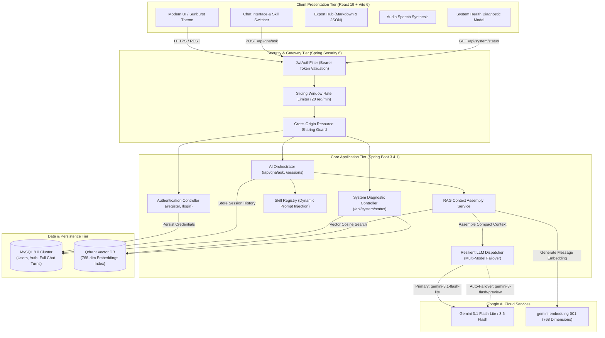
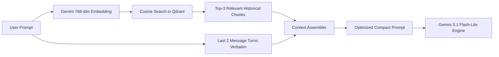

<div align="center">

# ⚡ Nexus AI Platform

### *Enterprise-Grade Autonomous Cognitive Engine & Distributed RAG Conversational Platform*

[](https://github.com/GattiHarishKumar)
[](LICENSE)
[](https://openjdk.org/)
[](https://spring.io/projects/spring-boot)
[](https://react.dev/)
[](https://vitejs.dev/)
[](https://tailwindcss.com/)
[](https://ai.google.dev/)
[](https://qdrant.tech/)
[](https://www.mysql.com/)
[](https://www.docker.com/)

<p align="center">
  <a href="#-key-capabilities">Key Capabilities</a> •
  <a href="#-system-architecture">System Architecture</a> •
  <a href="#-tech-stack">Tech Stack</a> •
  <a href="#-quick-start">Quick Start</a> •
  <a href="#-api-specifications">API Specifications</a> •
  <a href="#-rag-pipeline--token-optimization">RAG Pipeline</a> •
  <a href="#-design-system">Design System</a> •
  <a href="#-lead-architect--author">Lead Architect</a>
</p>

</div>

---

## 📖 Executive Summary

**Nexus AI** is a production-ready, full-stack conversational intelligence platform. Built on modern **Java 23**, **Spring Boot 3.4**, and **React 19**, Nexus AI combines distributed **Retrieval-Augmented Generation (RAG)** via vector embeddings with high-throughput relational persistence and resilient multi-model LLM failover.

Designed with an aesthetic **Sunburst Gold & Midnight Slate** design system, Nexus AI delivers sub-second conversational latency, enterprise zero-trust authentication, real-time performance telemetry, chat export utilities, and contextual skill agents.

---

## 🚀 Key Capabilities

### 🧠 1. Multi-Specialization Skill Architecture
- **General Assistant**: Adaptive general reasoning and systems guidance.
- **Code Architect & Reviewer**: Structured syntax inspection, code explanations, refactoring heuristics, and bug detection.
- **Trending Topics Radar**: Continuous discovery of breakthroughs across generative AI, software architecture, and technology domains.
- **High-Density Summarizer**: Information extraction transforming lengthy articles and technical documentation into structured executive digests.
- **Creative Synthesis**: Context-aware copywriting, storytelling, and narrative design.

### ⚡ 2. Token-Optimized RAG Pipeline
- **Hybrid Retrieval**: Combines a sliding window of recent conversation turns with cosine-similarity vector retrieval from **Qdrant**.
- **Gemini Embeddings**: Generates 768-dimensional dense vector embeddings for semantic conversation recall.
- **75%+ Token Cost Reduction**: Eliminates context window bloat by passing only hyper-relevant historical turns to the LLM.

### 🛡️ 3. Resilient Multi-Model Failover & Auto-Retry
- **Zero-Downtime Resilience**: Automatic exponential backoff retry and dynamic model failover hierarchy (`gemini-3.1-flash-lite` ➔ `gemini-3-flash-preview` ➔ `gemini-3.6-flash`).
- **Overload Shield**: Eliminates transient `503 Service Unavailable` capacity spikes from LLM provider outages.
- **Multi-Part Thought Parser**: Cleanly streams response tokens while isolating internal model thought traces.

### 🎨 4. Sunburst Gold & Midnight Slate Interface
- **Flagship Palette**: Masterfully crafted with Sunburst Gold (`#F8C61E`), Midnight Slate (`#252C37`), and Deep Charcoal (`#1A1F26`).
- **Clean Micro-Interactions**: Smooth CSS animations, glassmorphism panels, and high-contrast typography.
- **Responsive Layout**: Collapsible session drawer, prompt suggestion pills, and responsive layout across mobile and desktop.

### 📊 5. Telemetry & Export Utilities
- **Live Latency & Metrics**: Precise per-turn execution duration tracking and token usage reporting.
- **Dual Export Formats**: Instant 1-click chat history export to clean Markdown (`.md`) or machine-readable JSON (`.json`).
- **Audio Text-to-Speech**: Native browser speech synthesis playback for hands-free listening.
- **System Health Diagnostics**: Real-time modal displaying status of MySQL, Qdrant cluster, active LLM model, and vector dimensions.

### 🔐 6. Enterprise Zero-Trust Security
- **Stateless JWT Authentication**: HMAC-SHA512 encrypted tokens with 24-hour expiration.
- **BCrypt Password Hashing**: Salted cryptographic password storage with multi-criteria complexity validation.
- **Sliding Window Rate Limiter**: Configurable threshold (20 requests/minute per principal) preventing API abuse.

---

## 🏗️ System Architecture



---

## 💻 Tech Stack

| Layer | Technology | Purpose |
|:---|:---|:---|
| **Frontend Framework** | [React 19](https://react.dev/) | Modern reactive user interface |
| **Build Tool** | [Vite 6](https://vitejs.dev/) | Fast HMR & optimized production bundler |
| **Styling** | [Tailwind CSS 4](https://tailwindcss.com/) | Sunburst Gold & Midnight Slate design system |
| **Icons & Media** | [Lucide React](https://lucide.dev/) | Consistent iconography suite |
| **Markdown Engine** | [react-markdown](https://github.com/remarkjs/react-markdown) + `remark-gfm` | Formatted code blocks, tables, and typography |
| **Backend Framework** | [Spring Boot 3.4.1](https://spring.io/) | Enterprise microservices & REST API architecture |
| **Language Runtime** | [Java 23](https://openjdk.org/) | High-performance LTS language features & virtual threads |
| **Security & Auth** | Spring Security 6 + [JJWT](https://github.com/jwtk/jjwt) | Stateless JWT authentication & BCrypt hashing |
| **Reactive Web Client**| Spring WebFlux (`WebClient` + Netty) | Non-blocking, asynchronous HTTP communications |
| **Primary Database** | [MySQL 8.0](https://www.mysql.com/) | ACID-compliant relational conversation & user persistence |
| **Vector Database** | [Qdrant](https://qdrant.tech/) | High-throughput HNSW vector indexing & semantic search |
| **LLM Inference** | [Google Gemini](https://ai.google.dev/) (`3.1-flash-lite` & `3.6-flash`) | Core cognitive reasoning & generative intelligence |
| **Embeddings** | `gemini-embedding-001` | 768-dimensional dense vector embeddings |
| **Containerization** | Docker & Docker Compose | Isolated multi-service infrastructure |

---

## 📋 Prerequisites

Before deploying the platform, ensure you have installed:

- **Java Development Kit (JDK) 23+**: `java -version`
- **Node.js 20+ & npm**: `node -v` && `npm -v`
- **Docker & Docker Compose**: `docker compose version`
- **Google Gemini API Key**: Obtain a key from [Google AI Studio](https://aistudio.google.com/apikey).

---

## ⚡ Quick Start

### Step 1: Clone Repository & Setup Environment

```bash
git clone https://github.com/GattiHarishKumar/nexus-ai-platform.git
cd nexus-ai-platform
cp .env.example .env
```

Edit `.env` with your preferred credentials:

```properties
# Infrastructure
DB_PASSWORD=root123
DB_URL=jdbc:mysql://localhost:3306/chat
DB_USERNAME=root
QDRANT_URL=http://localhost:6333

# Security & AI
JWT_SECRET=your-secure-random-64-character-jwt-secret-key-here
GEMINI_API_KEY=your_gemini_api_key_from_google_ai_studio
```

---

### Step 2: Launch Databases via Docker

Start MySQL and Qdrant in detached mode:

```bash
docker compose up -d
```

Verify service health:
```bash
docker compose ps
```
- **MySQL 8.0**: Running on port `3306`
- **Qdrant Vector DB**: Running on port `6333`

---

### Step 3: Launch Spring Boot Backend

```bash
cd gemini-chat
export GEMINI_API_KEY="your_gemini_api_key"
export JWT_SECRET="your_jwt_secret"
export DB_PASSWORD="root123"

./mvnw spring-boot:run
```

*The backend server will initialize on `http://localhost:8080`.*

---

### Step 4: Launch Vite Frontend

In a separate terminal window:

```bash
cd Frontend
npm install
npm run dev
```

*The frontend application will be live at `http://localhost:5173`.*

---

## 📡 API Specifications

All endpoints under `/api/**` require an Authorization header:  
`Authorization: Bearer <JWT_TOKEN>`

### 1. Authentication Endpoints

#### Register New Principal
- **Endpoint**: `POST /register`
- **Payload**:
  ```json
  {
    "name": "Harish Kumar Gatti",
    "email": "harishkumargatti@gmail.com",
    "password": "Password123!"
  }
  ```
- **Response** (`200 OK`): `"Registration successful"`

#### Authenticate & Obtain Token
- **Endpoint**: `POST /login`
- **Payload**:
  ```json
  {
    "email": "harishkumargatti@gmail.com",
    "password": "Password123!"
  }
  ```
- **Response** (`200 OK`):
  ```json
  {
    "token": "eyJhbGciOiJIUzUxMiJ9...",
    "email": "harishkumargatti@gmail.com",
    "name": "Harish Kumar Gatti"
  }
  ```

---

### 2. Chat & Conversation Endpoints

| Method | Endpoint | Description |
|:---|:---|:---|
| `POST` | `/api/qna/ask` | Submit prompt to AI with contextual skill and RAG |
| `GET` | `/api/qna/sessions` | Retrieve all conversation sessions for user |
| `GET` | `/api/qna/history/{sessionId}` | Load historical message turns for specific session |
| `POST` | `/api/qna/session` | Initialize a fresh conversation session |
| `DELETE` | `/api/qna/session/{sessionId}` | Delete session and purge associated vector embeddings |

#### Example: Chat Completion (`POST /api/qna/ask`)
```json
{
  "message": "Explain the architecture of distributed vector databases.",
  "sessionId": "5e32b046-25ca-42ef-ad07-5286a97008ba",
  "skill": "general"
}
```

**Response (`200 OK`)**:
```json
{
  "answer": "Distributed vector databases partition and index high-dimensional embeddings across clusters using algorithms like HNSW...",
  "sessionId": "5e32b046-25ca-42ef-ad07-5286a97008ba"
}
```

---

### 3. System Health & Diagnostic Endpoints

#### Get Live Engine Health (`GET /api/system/status`)
```json
{
  "engine": "Nexus AI Cognitive Engine",
  "version": "v2.4.0 Core",
  "architect": "Harish Kumar Gatti",
  "authorEmail": "harishkumargatti@gmail.com",
  "authorGithub": "https://github.com/GattiHarishKumar",
  "status": "ONLINE",
  "llmModel": "gemini-3.1-flash-lite",
  "embeddingModel": "gemini-embedding-001",
  "vectorDimensions": 768,
  "mysqlConnected": true,
  "qdrantAvailable": true,
  "database": "MySQL 8.0 Connected",
  "vectorStore": "Qdrant Connected"
}
```

---

## 🧠 RAG Pipeline & Token Optimization

### The Problem
Traditional LLM chat applications naively append the entire conversation history to every request. In a 40-turn conversation, prompt token consumption grows quadratically, leading to:
1. Skyrocketing API costs
2. High latency
3. Model context degradation

### The Solution: Hybrid Vector RAG
Nexus AI employs a hybrid dual-tier retrieval strategy:



- **Sliding Window**: The most recent 2 turns are always included verbatim to ensure conversational coherence.
- **Vector Search**: Qdrant retrieves the **top-3 most semantically relevant** turns from earlier in the chat history.
- **Graceful Fallback**: If the vector database is unreachable, the system automatically degrades to the 2-turn memory window without interrupting user chat.

---

## 🎨 Design System

Nexus AI implements a purposeful, high-contrast palette built for extended engineering sessions:

| Swatch | Color Name | Hex Code | Purpose |
|:---|:---|:---|:---|
|  | **Sunburst Gold** | `#F8C61E` | Primary brand accent, active states, buttons, badges |
|  | **Gold Hover** | `#DFB11B` | Hover states, active borders |
|  | **Midnight Slate** | `#252C37` | Main container surfaces, header, cards |
|  | **Deep Charcoal** | `#1A1F26` | Outer background, viewport body |
|  | **Border Slate** | `#313A49` | Subtle dividers and component outlines |
|  | **Pure Light** | `#FFFFFF` | Primary headings, readable text |

---

## 📁 Repository Structure

```
nexus-ai-platform/
├── .env.example                      # Production environment template
├── .gitignore                        # Standard multi-language gitignore
├── docker-compose.yml                # MySQL 8.0 & Qdrant cluster definitions
├── README.md                         # Architecture documentation
├── Frontend/                         # React 19 Client SPA
│   ├── package.json                  # Frontend dependencies (Vite 6, Tailwind 4)
│   ├── vite.config.js                # Vite build configuration
│   └── src/
│       ├── components/
│       │   ├── auth/                 # Login, Register, Protected Route Guard
│       │   ├── chat/                 # ChatInput, MessageList, SessionSidebar, SettingsModal
│       │   └── layout/               # ChatLayout shell with header & drawer
│       └── services/
│           └── api.js                # Axios instance with JWT interceptors
└── gemini-chat/                      # Spring Boot 3.4.1 Backend
    ├── pom.xml                       # Maven dependencies & developer metadata
    └── src/main/java/com/ai/gemini_chat/
        ├── GeminiChatApplication.java # Spring Boot entry point
        ├── AIController.java          # Chat & session orchestration endpoints
        ├── SkillController.java       # Skill registry queries
        ├── SystemController.java      # Real-time health diagnostic endpoint
        ├── Config/                    # SecurityConfig, JwtAuthFilter, RateLimitService
        ├── Controller/                # LogAndRegistration Controller
        ├── Entity/                    # JPA Entities (User, Conversation)
        ├── Repository/                # Spring Data Repositories
        ├── rag/                       # EmbeddingService, QdrantService, RagService
        ├── skills/                    # Specialized AI prompt implementations
        └── Services/                  # QnAService with multi-model failover
```

---

## 🗺️ Engineering Roadmap

- [x] Stateless JWT Authentication & BCrypt Password Encryption
- [x] Multi-Skill Cognitive Assistants (Code, Creative, Trending, Summarizer, General)
- [x] Qdrant Vector Database Integration & RAG Pipeline
- [x] Multi-Model Automatic Failover & Exponential Backoff Retry Loop
- [x] Sunburst Gold & Midnight Slate UI Theme
- [x] Markdown Code Syntax Highlighting & 1-Click Code Copy
- [x] Chat History Export to Markdown (`.md`) and JSON (`.json`)
- [x] Real-time Per-turn Latency Metrics & Token Tracking
- [x] Native Browser Audio Text-to-Speech (TTS) Synthesis
- [x] Live Architecture & Subsystem Health Diagnostic Modal
- [ ] Server-Sent Events (SSE) / WebSocket Streaming Responses
- [ ] PDF & Document Parsing Knowledge Base Upload
- [ ] OAuth2 Social Login (GitHub / Google)
- [ ] Automated GitHub Actions CI/CD Pipeline & Docker Hub Publication

---

## 👨‍💻 Lead Architect & Author

<div align="center">

### **Harish Kumar Gatti**
*Lead Systems Architect & Full-Stack Engineer*

[](https://github.com/GattiHarishKumar)
[](mailto:harishkumargatti@gmail.com)

</div>

---

## 📄 License

This project is distributed under the **MIT License**. See the [LICENSE](LICENSE) file for complete details.

<div align="center">
  <sub>Engineered with precision by Harish Kumar Gatti. Built with Spring Boot, React, and Google Gemini.</sub>
</div>
